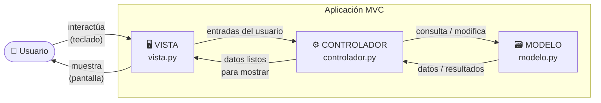
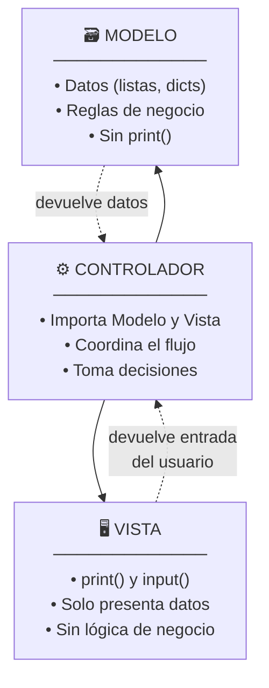

# El Patrón MVC: Modelo, Vista, Controlador
### Curso: II-1119 Fundamentos de Tecnología Digital

---

## 1. ¿Qué problema resuelve MVC?

Imagina que estás escribiendo un programa para gestionar el inventario de una fábrica. Al principio, todo cabe en un archivo: lees datos, haces cálculos y muestras resultados, todo mezclado. Cuando el programa crece, surge el caos:

- ¿Dónde está la función que calcula el stock mínimo?
- Si quiero mostrar los datos en una tabla en lugar de en texto plano, ¿tengo que reescribir todo?
- Si dos personas trabajan en el código al mismo tiempo, ¿en qué parte trabaja cada una?

**MVC** (Modelo–Vista–Controlador) es una forma de *organizar* el código dividiéndolo en tres capas con responsabilidades claramente separadas. No es un lenguaje ni una librería: es una **convención de diseño**, como los planos de una fábrica que separan la zona de producción, el almacén y la oficina de administración.

---

## 2. La analogía de la fábrica

| Zona de la fábrica | ¿Qué hace? | Equivalente en MVC |
|---|---|---|
| **Almacén** | Guarda la materia prima y los productos | **Modelo** |
| **Línea de producción** | Transforma materiales y toma decisiones | **Controlador** |
| **Sala de exhibición / reporte** | Muestra el producto al cliente | **Vista** |

El almacén no sabe cómo se exhibe el producto. La sala de exhibición no sabe cómo se fabrica. La línea de producción coordina ambos.

---

## 3. Las tres capas explicadas

### 3.1 Modelo — *"Los datos y las reglas"*

El Modelo es responsable de:

- Guardar y organizar los datos (listas, diccionarios, archivos).
- Contener las reglas del negocio (¿cuándo un producto está bajo de stock? ¿cómo se calcula el precio con descuento?).
- **No sabe nada** de cómo se verán esos datos en pantalla.

```python
# modelo.py
# El Modelo gestiona los datos del inventario

inventario = {
    "tornillos": {"cantidad": 500, "minimo": 100, "precio": 0.05},
    "tuercas":   {"cantidad":  80, "minimo": 100, "precio": 0.03},
    "placas":    {"cantidad": 200, "minimo":  50, "precio": 1.20},
}

def obtener_producto(nombre):
    """Devuelve los datos de un producto."""
    return inventario.get(nombre, None)

def actualizar_cantidad(nombre, nueva_cantidad):
    """Actualiza la cantidad de un producto en el inventario."""
    if nombre in inventario:
        inventario[nombre]["cantidad"] = nueva_cantidad
        return True
    return False

def esta_bajo_stock(nombre):
    """Regla de negocio: ¿el producto está por debajo del mínimo?"""
    producto = obtener_producto(nombre)
    if producto:
        return producto["cantidad"] < producto["minimo"]
    return False

def listar_productos():
    """Devuelve la lista de nombres de productos."""
    return list(inventario.keys())
```

> **Nota:** El Modelo no imprime nada con `print()`. Solo maneja datos y devuelve resultados.

---

### 3.2 Vista — *"Lo que el usuario ve"*

La Vista es responsable de:

- Mostrar información al usuario (texto en consola, tabla, archivo, etc.).
- Recibir las entradas del usuario (lo que escribe en el teclado).
- **No hace cálculos ni modifica datos directamente.**

```python
# vista.py
# La Vista se encarga de la presentación

def mostrar_menu():
    """Muestra el menú principal al usuario."""
    print("\n===== SISTEMA DE INVENTARIO =====")
    print("1. Ver todos los productos")
    print("2. Buscar un producto")
    print("3. Actualizar cantidad")
    print("4. Salir")
    print("=================================")

def mostrar_producto(nombre, datos, alerta=False):
    """Muestra los datos de un producto con formato."""
    print(f"\n  Producto : {nombre}")
    print(f"  Cantidad : {datos['cantidad']} unidades")
    print(f"  Mínimo   : {datos['minimo']} unidades")
    print(f"  Precio   : ${datos['precio']:.2f}")
    if alerta:
        print("  ⚠️  ALERTA: Stock por debajo del mínimo")

def mostrar_lista(productos):
    """Muestra una lista de productos."""
    print("\nProductos disponibles:")
    for i, nombre in enumerate(productos, start=1):
        print(f"  {i}. {nombre}")

def mostrar_error(mensaje):
    """Muestra un mensaje de error."""
    print(f"\n  ❌ Error: {mensaje}")

def mostrar_exito(mensaje):
    """Muestra un mensaje de éxito."""
    print(f"\n  ✅ {mensaje}")

def pedir_texto(prompt):
    """Solicita texto al usuario."""
    return input(f"\n  {prompt}: ").strip()

def pedir_numero(prompt):
    """Solicita un número entero al usuario."""
    return int(input(f"\n  {prompt}: "))
```

> **Nota:** La Vista no accede al diccionario `inventario` directamente. Recibe los datos ya preparados para mostrarlos.

---

### 3.3 Controlador — *"El coordinador"*

El Controlador es responsable de:

- Recibir lo que el usuario solicita (a través de la Vista).
- Pedirle al Modelo que busque o modifique datos.
- Enviarle a la Vista los datos listos para mostrar.
- **Es el intermediario**: nunca muestra cosas directamente ni guarda datos él mismo.

```python
# controlador.py
import modelo
import vista

def ver_todos():
    """Flujo: mostrar todos los productos."""
    productos = modelo.listar_productos()   # 1. Pide datos al Modelo
    vista.mostrar_lista(productos)          # 2. Pasa datos a la Vista

def buscar_producto():
    """Flujo: buscar y mostrar un producto específico."""
    nombre = vista.pedir_texto("Nombre del producto")     # 1. Pide entrada al usuario
    datos = modelo.obtener_producto(nombre)               # 2. Consulta al Modelo
    if datos:
        alerta = modelo.esta_bajo_stock(nombre)           # 2b. Consulta regla de negocio
        vista.mostrar_producto(nombre, datos, alerta)     # 3. Muestra resultado
    else:
        vista.mostrar_error(f"No existe el producto '{nombre}'")

def actualizar_cantidad():
    """Flujo: actualizar el stock de un producto."""
    nombre = vista.pedir_texto("Nombre del producto")
    if not modelo.obtener_producto(nombre):
        vista.mostrar_error(f"No existe el producto '{nombre}'")
        return
    nueva = vista.pedir_numero("Nueva cantidad")
    exito = modelo.actualizar_cantidad(nombre, nueva)     # Modifica en el Modelo
    if exito:
        vista.mostrar_exito(f"Cantidad de '{nombre}' actualizada a {nueva}")
    else:
        vista.mostrar_error("No se pudo actualizar")

def ejecutar():
    """Bucle principal de la aplicación."""
    while True:
        vista.mostrar_menu()
        opcion = vista.pedir_texto("Selecciona una opción")
        if opcion == "1":
            ver_todos()
        elif opcion == "2":
            buscar_producto()
        elif opcion == "3":
            actualizar_cantidad()
        elif opcion == "4":
            print("\nHasta luego.\n")
            break
        else:
            vista.mostrar_error("Opción no válida")
```

---

### 3.4 Punto de entrada — `main.py`

```python
# main.py
import controlador

controlador.ejecutar()
```

El archivo principal es mínimo: solo arranca el sistema. Toda la lógica está repartida en sus tres responsables.

---

## 4. Diagrama del flujo de datos



> **Lectura del diagrama:** el usuario solo habla con la Vista. La Vista solo habla con el Controlador. El Controlador es el único que toca el Modelo. Los datos siempre siguen ese camino de ida y vuelta.

---

## 5. Estructura de archivos del proyecto

```
inventario/
│
├── main.py          ← Punto de entrada (arranca todo)
├── modelo.py        ← Datos y reglas de negocio
├── vista.py         ← Presentación e interacción con el usuario
└── controlador.py   ← Coordina Modelo y Vista
```

Cada capa es un módulo independiente. Esto es exactamente lo que ya conocen: `import modelo`, `import vista`, igual que cuando importan `math` o cualquier módulo propio.

---

## 6. ¿Por qué separar en tres capas?

| Ventaja | Ejemplo concreto |
|---|---|
| **Cambiar la Vista sin tocar nada más** | Hoy muestra en consola; mañana genera un archivo CSV. Solo cambia `vista.py`. |
| **Cambiar los datos sin afectar la interfaz** | Hoy los datos están en un diccionario; mañana vienen de un archivo Excel. Solo cambia `modelo.py`. |
| **Trabajo en equipo** | Una persona trabaja en `modelo.py` y otra en `vista.py` sin pisarse. |
| **Probar partes por separado** | Puedo probar todas las funciones del Modelo sin ejecutar la interfaz completa. |
| **Código más legible** | Sé exactamente dónde buscar si hay un error de presentación (Vista) o un error de cálculo (Modelo). |

---

## 7. Reglas de oro del MVC

```
┌─────────────────────────────────────────────────────────┐
│  ✅ El MODELO puede ser llamado por el Controlador.      │
│  ✅ La VISTA puede ser llamada por el Controlador.       │
│  ✅ El CONTROLADOR importa y usa Modelo y Vista.         │
│                                                         │
│  ❌ El MODELO NO debe llamar a la Vista.                 │
│  ❌ La VISTA NO debe modificar datos del Modelo.         │
│  ❌ El MODELO NO debe importar al Controlador.           │
└─────────────────────────────────────────────────────────┘
```

Una forma fácil de recordarlo: si encuentras un `print()` dentro de `modelo.py`, algo está mal.

---

## 8. Resumen visual



---

## 9. Ejercicio propuesto

Amplía el sistema de inventario con las siguientes funciones, respetando MVC:

1. **Modelo:** agrega una función `calcular_valor_total(nombre)` que retorne `cantidad × precio`.
2. **Vista:** agrega `mostrar_valor(nombre, valor)` que imprima ese valor con formato de moneda.
3. **Controlador:** agrega la opción 4 al menú que calcule y muestre el valor total de un producto.

**Pregunta de reflexión:** ¿en qué archivo agregarías la lógica para saber si el valor total supera $500? ¿Por qué?

---

*Documento preparado para el curso II-1119 Fundamentos de Tecnologías Digitales— Ingeniería Industrial.*
